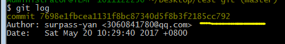
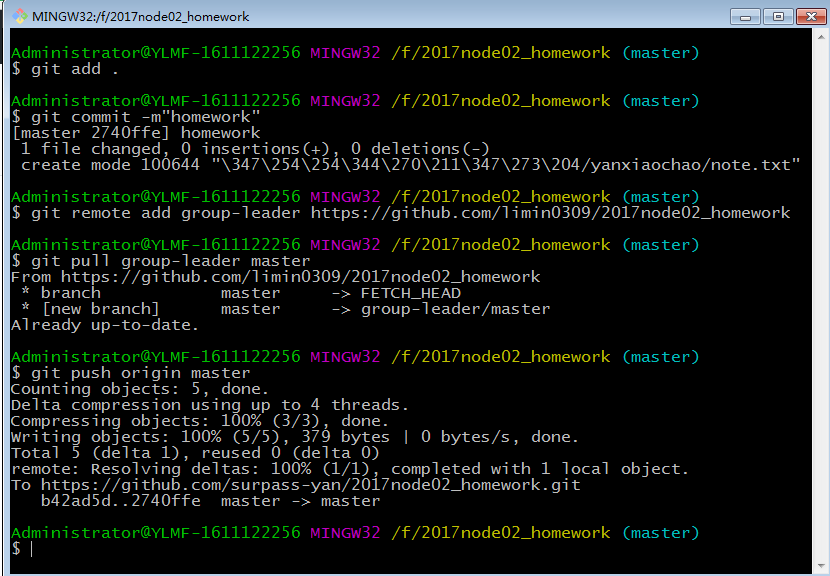

#GIT笔记
[toc]
##git
集中式系统：中间服务器，每个人没有完整版本的代码。存储文件 每一个文件下都有.svn的文件
分布式系统：每个人都相当于一个服务器，相互之间有联系。所有内容都存在.git文件下

###命令
- `git config --list`  查看配置信息
- `clear` 清除命令面板里的信息 还能查看清除的内容
- `--global user.name+名字`    配置全局用户名
- `--global user.email+邮箱`   配置邮箱
- `git init`    初始化
- `mkdir 目录名字`      创建目录，名字不要大写，一把用-隔开。蛇形命名法
- `cd 文件夹名`，进入文件夹 ，change directroy 。文件名按tab可自动补全
- `cd ..` 回到上一级
- `mkdir test-git && cd test-git` 创建并进入目录
- `git init` 初始化仓库
- `ls`  查看文件
- `ls  -all` 查看所有文件，包括隐藏文件
- `touch`   创建文件
- `cat index.txt`   查看
- `vi index.txt`   vi常用命令  i 插入  esc+：wq保存并退出
- `git status` 查看git状态，看是在暂存区还是在   历史区      红色表示没有在暂存区中，绿色表示在暂存区
- `git add .`或者`git add 文件名` 把文件从工作区提交到暂存区
- `git commit -m“init commit”` 把文件从暂存区加入到历史区
- `git log` 查看提交日志，出现个commit 后面的内容就是版本号
- `git diff`    查看各个区的不同，工作区 暂存区 历史区
- 各个区的比较
	- `git diff`  比较工作区和暂存区
	- `git diff --cached`   比较暂存区和历史区 
	- `git diff master`   比较工作区和历史区
- 版本回退
	- `git checkout 文件名`    滚回到提交之前的版本。从暂存区中覆盖掉工作区的，恢复某个版本文件
	- `git reset --hard id(版本号)`   从历史区拉回到工作区，通过版本id恢复
	- `git reflog` 查看当时回滚时的版本

- `git reset HEAD .  `   删除上一次添加到暂存区的内容（.可以换成文件名）

###webstorm里提交
>首先打开文件夹，选中VCS中的第二项配置Git;在文件夹名称处右键 ---git---add---在文件夹处添加一个忽略文件.gitignore,在文件里写上要忽略不上传的文件，一般有.idea ，node_modules，然后文件夹右键--git --add---commit 
####添加忽略文件 
.gitignore  
.DS_Store
node_modules
.idea

##git分支管理
###创建分支
- `git branch` 查看分支，*表示当前在这个分支里
- `git branch 分支名`    创建分支，创建的分支和master基本一样
- `git checkout 分支名`  切换到这个分支
- `git branch -D 分支名`  删除分支  不能再要删除的这个分支里删除这个分支。不能自己删自己
- `git checkout -b 分支名`  创建并切换到分支   ；等于git branch    git checkout两步合并在一起
- 将内容提交到某个分支上，默认我们的代码是放在工作区上的，不属于任何分支，只有提交到某个分支上，此文件才归属于特定的分支

###合并分支
- `git merge 分支名`   快转（fast-forward)主干没有任何更新，分支提交了新的代码
>将主干的指针快速指向分支最新的代码即可
>提交过的文件可以一步到位提交：`git commit -a -m"ok"` 。
- conflict 合并多个分支时，可能合并的内容会产生冲突，手动解决冲突，打开合并的文件，删除冲突项，把带<的删掉。之后在提交
>`history  >1.txt`    把命令版里输的命令导出来

##仓库
1.创建有内容的文件：在本地文件夹里打开gIt bash 命令，首先创建一个readme文件。` echo "#node_homework">README.MD`
2.`git init `初始化
3.`touch .gitignore`创建忽略文件
4.` vi .gitignore`写入忽略文件
 .idea
node_modules
.DS_Store
bower_components
5.提交到历史区 `git add` `git commit -m"`
6.查看远程仓库连接`git remote -v`没有连接，操作：`git remote add origin 仓库地址`，在执行`git remote -v`查看是否与仓库建立了连接  origin 代表仓库地址
7.推送：`git push origin master`把master分支推送到仓库上

>如果之前推送到master的时候，如果加了一个`git push origin master -u`，那么之后推送的时候，直接使用`git push`就可以推送到master上了

###线上线下不一致
需要先拉取仓库上最新代码，然后在本地进行合并，`merge`    `git add .`  ` git commit -m""`
最后push到仓库上

1.将线上最新代码拉倒master上
`git pull origin master`

###部署git静态网页
将网页通过git 网址访问（只能放静态页，不能放置server)
步骤：
- 1.需要一个特定的分支（gh-pages)
- 2.将代码提交到这个分支上
- 3.推送到gitHub上，将gh-pages推送到分支上
- 4.在gitHub中的setting上可以找到这个网址

####作业
1。fork组长仓库，克隆一份放到自己仓库上
一个项目只能fork一次，代码更新之间不会影响。
2。克隆 是将线上的项目拉取到本地，拉下来后就是git 仓库，而且已经添加好了远程仓库地址。`git clone 地址 别名`clone 后面是老师/组长仓库地址，可能他人的仓库名称比较长，后面可以起个别名，就是文件夹的名字
#####组员fork组长
1.打开组长git地址，点击fork；
2.当看到名字变成自己的名字后，说明fork成功
3.点击
复制地址
4.在本地打开git bash ，`git clone 地址`可以在地址前起别名，也可以不起，不起的话，默认文件夹名称是组长的仓库的名称
5.`git add .`添加文件
6.`git commit -m"""`
7.`git remote add gropu-leader 组长地址`gropu-leader是起的别名，代表组长的仓库地址
8.`git pull  gropu-leader master`
9.`git push origin master`推送到自己仓库

